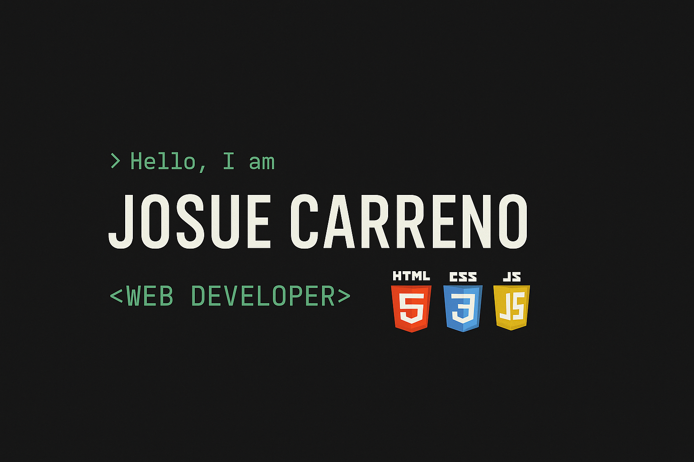

# 👋 Hello! I'm Josue Carreño

I'm a web developer in progress, currently focused on building my front-end skills.  
I enjoy writing clean code and turning ideas into functional and visually appealing websites.

---

## 🛠️ Technologies I'm working with:

---

## 🚀 Goals

- 📘 Learn JavaScript frameworks (starting with **React**)
- ♿ Master responsive and accessible design
- 🤝 Collaborate on open source projects

---

## 📫 Let's connect!

Check out my work and follow my journey here on GitHub:

🔗 [@josueCarreno](https://github.com/josueCarreno)

---

> ⭐ If you like what you see, consider giving a ⭐ to support my projects!
